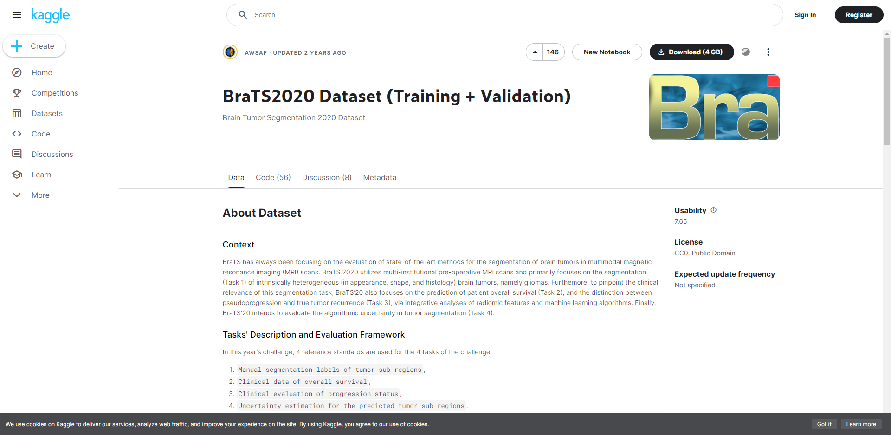

# Nifti神经影像信息学数据格式
医疗图像是对解剖区域的内部结构和功能的一种表征。它以二维像素或者三维体素的形式呈现出来。映射到空间位置的数值是对采样过程和重建过程的离散表征。用来描述一个确定采样模态视野的像素数量是对解剖结构和功能的细节的表达。  
像素表达的数值取决于成像模式、采样协议、重建以及后续处理过程。
## 医疗影像数据[1](https://www.jiqizhixin.com/articles/2017-07-31)
组成: 像素深度、光度解释、元数据以及像素数据.
1. 像素深度-pixel depth  
也可以是位深度(Bit Depth)或色深度(Color Depth),这表示的那个像素所记录信息所用到的位数.
例如一个八位深度的像素点会由0-255这256个不同的数值选择,位深度越大,记录数据所需越多的存储空间.

2. 光度解释  
光度解释具体化了像素数据被解释成正确的图片展示的方式，如单色图像或者彩色图像。类似于RGB图像的通道.

3. 元数据  
元数据就是图片中所描述的信息。它至少会包含以下信息：图像矩阵的维度、空间精度、像素深度以及光度解释。

4. 像素数据  
这里存储的是像素数值的大小。

## NIFITI
NIFTI最初是用于神经成像的，但它也适用于一些其他的领域。NIFTI中一个主要的特点在于它包含了两个仿射坐标定义，这两个仿射坐标定义能够将每个立体元素指标（i,j,k）和空间位置（x,y,z）联系起来。  
扩展名是.nii，包含了头文件及图像资料,nii格式和.nii.gz格式是一个东西。

__DICOM 和 NIfTI 这两种格式的主要区别是：NIfTI 中的图像原始数据被存储成了 3 维图像，而 dicom 一些 2 维的图层。这就使得 NIFTI 更加适合那些应用在 DICOM 上的机器学习的方法，因为它是以 3D 图像建模的。处理一个单独的 NIFTI 文件要比处理成百上千个 dicom 文件更加容易一些。与 DICOM 格式下的好多个文件相比，NIFTI 格式下，每个 3d 图像只有两个文件。__

## 数据预处理流程
1. 裁剪到non-zero values区域
2. 重采样至数据集的中值体素间距
3. padding体积,使样本尺寸与补丁大小相同
4. 标准化: 0均值标准化

# 脑肿瘤数据集BraTS
多模态脑部肿瘤分割数据集-brats，其成像元数据来自核磁共振影像。BraTS 一直专注于评估在多模态磁共振成像 (MRI) 扫描中分割脑肿瘤的最先进方法。所有 BraTS 多模式扫描均以 NIfTI 文件 (.nii.gz) 的形式提供，所有成像数据集均由一到四名评估者按照相同的注释协议手动分割，并且它们的注释得到了经验丰富的神经放射科医生的批准。注释包括GD-enhancing tumor (ET — label 4), the peritumoral edema (ED — label 2), and the necrotic and non-enhancing tumor core (NCR/NET — label 1)

BraTS全名是Brain Tumor Segmentation，即脑部肿瘤分割。世界卫生组织（WHO）按细胞来源和行为对脑肿瘤进行分类：  
* 非恶性脑肿瘤被分类为I级或II级，也被称为低度（low grade, LG）肿瘤，LG肿瘤不会严重影响患者的预期寿命
* 恶性肿瘤被分类为III级或IV级，被称为高度（high grade, HG），与HG肿瘤的最大预期寿命只有两年不同

__任务定义__  
改善疾病诊断，治疗计划，监测和临床试验，需要可靠的脑肿瘤分割来检测肿瘤的位置和范围。
1. 分割
整体肿瘤分割(ED)
核心肿瘤分割(ET)
增强肿瘤分割(Net)
2. 标签
gd增强肿瘤(ET)  
瘤周水肿/侵袭组织(ED)  
坏死肿瘤核心(NCR)区域  
所有MRI扫描图像大小为240×240×155，模态间共享分割标签  

3. 数据模态
解决此问题的常用方法是整合从多种MRI模态中获取的信息，模态包括：  
* T1加权MRI（T1）
* 加造影剂的T1加权MRI（T1c）
* T2加权MRI（T2）
* 液体衰减反转恢复（FLAIR）MRI   

4. 数据预处理
   * 同解剖模板配准
   * 各向同性1mm3分辨率插值
   * 颅骨剥离进行预处理。

__Brats数据集__  
对应在BraTs数据集中的数据文件：  
* XXX.Flair 液体衰减反转恢复MRI
* XXX.T1 加权MRI
* XXX.T1c 加造影剂的T1加权MRI
* XXX.T2 T2加权MRI
* XXX.OT label，标签内容0,1,2,3,4， 背景+4类  

带有手动注释的三种成像模式（A = FLAIR，B = T2，C = T1c）上的肿瘤外观，以及右侧的三个标签的融合（D）  
* 全肿瘤（黄色）
* 肿瘤核心（红色）
* 增强肿瘤核心（浅蓝色）
* 核心的囊性坏死成分（绿色））

__数据集总结__
BraTs数据不一样的地方就是，它是多模态的，光输入数据就是4个模态，每一个模态都是一个三维的断层扫描数据。

## 数据下载和预处理
__数据集下载__  

推荐在kaggle下载获取，过程稍复杂:kaggle：https://www.kaggle.com/datasets/awsaf49/

  
注册kaggle时会遇到Captcha must be filled out问题，人机验证被墙，解决方法：[go](https://blog.csdn.net/weixin_46713695/article/details/125474130?ops_request_misc=%257B%2522request%255Fid%2522%253A%2522166357292316782428643192%2522%252C%2522scm%2522%253A%252220140713.130102334.pc%255Fall.%2522%257D&request_id=166357292316782428643192&biz_id=0&utm_medium=distribute.pc_search_result.none-task-blog-2~all~first_rank_ecpm_v1~rank_v31_ecpm-1-125474130-null-null.142^v47^new_blog_pos_by_title,201^v3^control_1&utm_term=Captcha%20must%20be%20filled%20out.&spm=1018.2226.3001.4187)  
官网链接：https://www.med.upenn.edu/cbica/brats2020/  
注册飞桨下载，这是较快的获取方法，但只能下载BraTS2019。    
"BraTS2019"数据集下载链接：https://aistudio.baidu.com/aistudio/datasetdetail/67772

## 训练前的准备工作
创建三个文件夹，nnUNet_raw用于输入数据集、nnUNet_preprocessed我们不需要主动去处理它、nnUNet_trained_models会存储训练好的结果。首先，在nnUNet_raw_data内新建一个任务文件夹，命名为"Task082_BraTS2020"，用现成的脚本把BraTS数据集进行转换。会得到处理后的文件格式：imagesTr装训练集，imagesTs装测试集（可以是空的），imagesVal装验证集，labelsTr是训练集对应的分割结果。dataset.json保存整个任务数据的信息。
__预处理__
   BraTS 2020数据集不能直接用，在训练模型之前还要把这个数据集进行一些（更多是格式上的）预处理，主要有两个步骤：Dataset conversion和Experiment planning and preprocessing。nnUNet同样提供了现成的工具，下面是如何使用它们：  
   * gzip 文件压缩，遍历压缩training文件和validation文件夹，使用gzip指令压缩
   > gzip -r   # 压缩原始数据.nii至.nii.gz 格式
   > cd /work/wuzihao/demo/dataset/nnUNet_raw/nnUNet_raw_data/Task082_BraTS2020/BraTS2020_TrainingData
   > gzip -r BraTS20_Training_001/ ...
   * Dataset conversion    
  （nnUNet/Task082_BraTS_2020.py at master · MIC-DKFZ/nnUNet · GitHub   //在py函数中修改主函数，主要是修改BraTS2020源数据所在路径和nnUNet_raw_data路径即可）
   > python /work/wuzihao/demo/nnUNet/nnunet/dataset_conversion/Task082_BraTS_2020.py

   * Planning and preprocessing  
  傻瓜操作，直接在命令行输入"nnUNet_plan_and_preprocess -t 082 --verify_dataset_integrity" ("XXX" 表示任务编号，3位数)即可。目的是一些数学上的预处理。
  > nnUNet_plan_and_preprocess -t 082 --verify_dataset_integrity

__单模态和多模态__
上文所讲的都是默认处理BraTS 2020的所有模态，也可处理BraTS 2020单个模态（比如t1）。主要差别在数据准备阶段的Dataset Conversion步骤[参考](https://blog.csdn.net/qq_45794210/article/details/120699443?ops_request_misc=%257B%2522request%255Fid%2522%253A%2522166357355116782425157526%2522%252C%2522scm%2522%253A%252220140713.130102334..%2522%257D&request_id=166357355116782425157526&biz_id=0&utm_medium=distribute.pc_search_result.none-task-blog-2~all~sobaiduend~default-1-120699443-null-null.142^v47^new_blog_pos_by_title,201^v3^control_1&utm_term=brats2020&spm=1018.2226.3001.4187)：