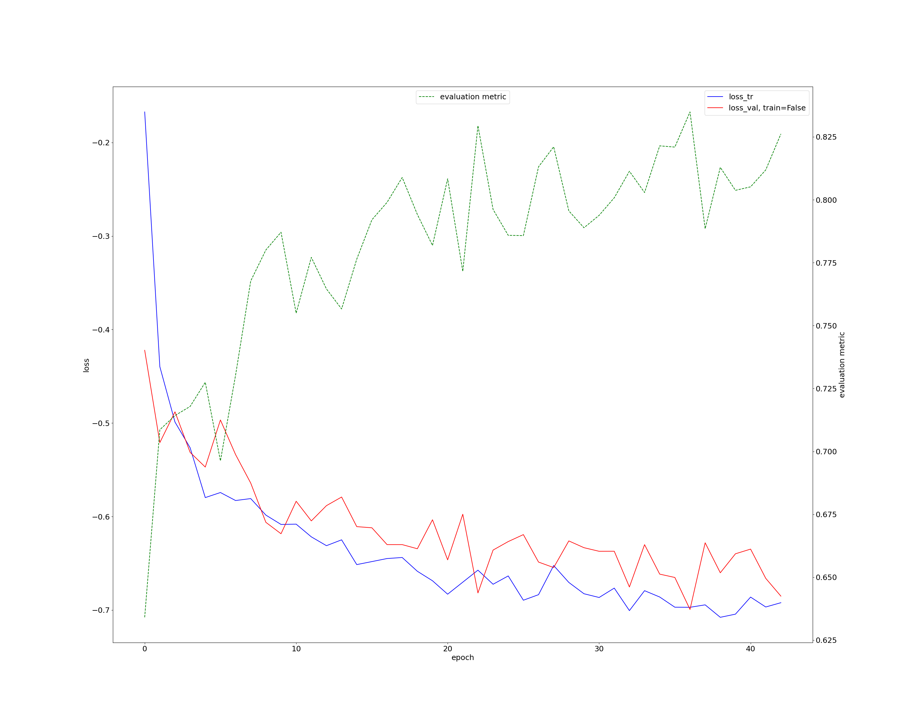

# nnUnet训练-基于BraTs脑肿瘤分割任务


## [网络训练](https://blog.csdn.net/CabbageRoll/article/details/126352333)
数据集下载解压后，放置在先前创建的nnUNet_raw文件夹下的nnUnet_raw_data路径下，根据[DATASET](DATASET.md)文档操作，将数据进行格式转换和预处理。nnUNet_cropped_data文件夹（在nnUnet_raw_data问价夹同级）内会自动保存下一步裁剪后的数据集，我们也不需要主动去处理它。
__nnUNet安装__
1. 用作标准化基线、开箱即用的分割算法
```
   pip install nnunet
```
2. 在本机创建nnUNet代码副本
```
git clone https://github.com/MIC-DKFZ/nnUNet.git
cd nnUNet
pip install -e .
```

3. 修改本地代码(主要是改掉原数据存储路径)  
```
// ./nnunet/dataset_conversion/Task082_BraTS_2020.py
task_name = ""
nnUNet_raw_data = ""
downloaded_data_dir = ""
downloaded_data_dir_val = ""
```
### [数据预处理](https://github.com/noil-lion/TRITON_LEARN/blob/main/demoV2/nnUnet_deploy/DATASET.md#%E6%95%B0%E6%8D%AE%E4%B8%8B%E8%BD%BD%E5%92%8C%E9%A2%84%E5%A4%84%E7%90%86)
__训练脚本pipeline__
```
//pipeline.sh
CUDA_VISIBLE_DEVICES=0 nnUNet_train 3d_fullres nnUNetTrainerV2 Task082_BraTS2020 0
CUDA_VISIBLE_DEVICES=0 nnUNet_train 3d_fullres nnUNetTrainerV2 Task082_BraTS2020 1
CUDA_VISIBLE_DEVICES=1 nnUNet_train 3d_fullres nnUNetTrainerV2 Task082_BraTS2020 2
CUDA_VISIBLE_DEVICES=1 nnUNet_train 3d_fullres nnUNetTrainerV2 Task082_BraTS2020 3
CUDA_VISIBLE_DEVICES=2 nnUNet_train 3d_fullres nnUNetTrainerV2 Task082_BraTS2020 4
```
每一行表示一个任务，"CUDA_VISIBLE_DEVICES=X"，表示用服务器的第X张显卡；"nnUNet_train 3d_fullres nnUNetTrainerV2"是BraTS 2020对应的指令，"TaskXXX_NAME"表示任务文件名，和上文对应。最后的编号表示是第几折，这里总共跑了5 folds。
> CUDA_VISIBLE_DEVICES=0 nnUNet_train 3d_fullres nnUNetTrainerV2 Task082_BraTS2020 4
```
###############################################
I am running the following nnUNet: 3d_fullres
My trainer class is:  <class 'nnunet.training.network_training.nnUNetTrainerV2.nnUNetTrainerV2'>
For that I will be using the following configuration:
num_classes:  3
modalities:  {0: 'T1', 1: 'T1ce', 2: 'T2', 3: 'FLAIR'}
use_mask_for_norm OrderedDict([(0, True), (1, True), (2, True), (3, True)])
keep_only_largest_region None
min_region_size_per_class None
min_size_per_class None
normalization_schemes OrderedDict([(0, 'nonCT'), (1, 'nonCT'), (2, 'nonCT'), (3, 'nonCT')])
stages...

stage:  0
{'batch_size': 2, 'num_pool_per_axis': [5, 5, 5], 'patch_size': array([128, 128, 128]), 'median_patient_size_in_voxels': array([139, 170, 138]), 'current_spacing': array([1., 1., 1.]), 'original_spacing': array([1., 1., 1.]), 'do_dummy_2D_data_aug': False, 'pool_op_kernel_sizes': [[2, 2, 2], [2, 2, 2], [2, 2, 2], [2, 2, 2], [2, 2, 2]], 'conv_kernel_sizes': [[3, 3, 3], [3, 3, 3], [3, 3, 3], [3, 3, 3], [3, 3, 3], [3, 3, 3]]}

I am using stage 0 from these plans
I am using sample dice + CE loss

I am using data from this folder:  /work/wuzihao/demo/dataset/nnUNet_preprocessed/Task082_BraTS2020/nnUNetData_plans_v2.1
###############################################
loading dataset
loading all case properties
2022-09-20 10:56:47.380653: Using splits from existing split file: /work/wuzihao/demo/dataset/nnUNet_preprocessed/Task082_BraTS2020/splits_final.pkl
2022-09-20 10:56:47.381785: The split file contains 5 splits.
2022-09-20 10:56:47.381882: Desired fold for training: 4
2022-09-20 10:56:47.381942: This split has 295 training and 73 validation cases.
unpacking dataset
done
2022-09-20 10:56:59.127858: lr: 0.01
using pin_memory on device 0
```
__任务__  
单个病例数据有四个模态，四个模态预测一个分割任务，分割的目标有3个类别（1-瘤周水肿，2-非增强坏死肿瘤核心，3-增强肿瘤核心）+1个背景（0）  
__输入输出维度__    
* 网络输入  
  295 例样本用于训练  
  73 例样本用于验证   
  网络输入选择3D格式的原始数据输入  
  batchsize默认是2，也就是每完成一次完整的训练，输入数据是训练集中的两个数据样本用于训练修正网络参数。   
  输入原始数据维度为155x240x240,240x240是x,y维度，155是z维度，150层240*240的断层扫描，在进入网络之前，需要进行一定的预处理程序。原始数据的体素维度是139x170x138,经patch后的patch_size维度是128x128x128,合并四模态，最后的输入维度是1x4x128x128x128   
     
* 网络输出  
  与输入同维度1x4x128x128x128  

## 训练可视化
  

__可能有用的连接__    
nnUNet代码解读分析：[LINK1](https://blog.csdn.net/weixin_44858814/article/details/124517608?ops_request_misc=&request_id=&biz_id=102&utm_term=sample%20dice%20+%20CE%20loss&utm_medium=distribute.pc_search_result.none-task-blog-2~all~sobaiduweb~default-0-124517608.142^v47^new_blog_pos_by_title,201^v3^control_1&spm=1018.2226.3001.4187)  
dice-loss:[LINK2](https://blog.csdn.net/weixin_38324954/article/details/116229663?ops_request_misc=&request_id=&biz_id=102&utm_term=sample%20dice%20+%20CE%20loss&utm_medium=distribute.pc_search_result.none-task-blog-2~all~sobaiduweb~default-2-116229663.142^v47^new_blog_pos_by_title,201^v3^control_1&spm=1018.2226.3001.4187)

