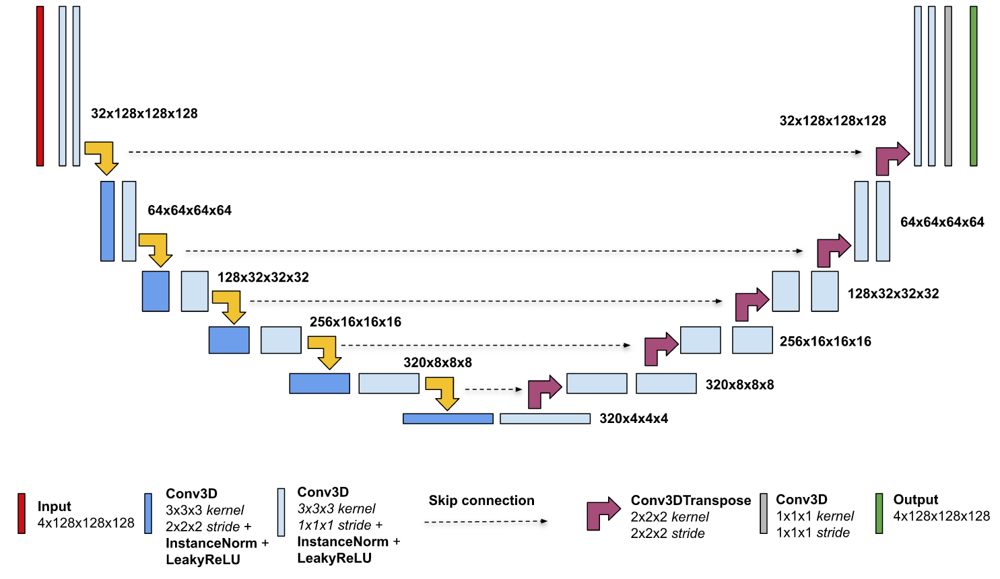

# nnUnet网络模块详解

## 盲点概念
1. 转置卷积:  
卷积操作的转置,在网络中可以起到上采样操作,恢复特征图的空间位置信息.

2. 特征融合:  
特征融合是指将上采样所得的特征图与体征提取的特征图进行特征融合,Unet的融合机制和FCN的略有不同.
* Unet:拼接,采用的是将特征图在channel维度拼接在一起，形成更厚的特征。对应于 TensorFlow的tf.concat()函数，比较占显存。
* FCN: 将特征图的像素值对应点进行相加融合,channel维度不再扩张,对应是实现是TensorFlow中的tf.add()函数.

3. 输入预处理
* __patch样本切片__:医学图像size很大,分割任务时不能将原图输入网络,所以要将图像切割成一张一张的小patch喂入网络,patch_size也就是切割子集的图像维度,这样做相当于数据增强(样本扩充),且能准确定位切割位置.
* __overlap重叠切片__:在输入切割方式上,最好是在切图时包含周围区域,周边部分像素的产生可通过overlap的padding产生,如Overlap-tile策略采用的是镜像padding,这样做可以让周围overlap部分可以为分割区域边缘部分提供纹理等信息.同时还有很多其它的切片方式,如随机切片,按序切片等.如下图是镜像padding.  

4. 输出后处理  
将图像切片后,模型对切片patch进行预测,那么通常我们需要将这些切片的预测结果重新组合成整张图像对应的预测结果以方便评估和可视化。这里就涉及到一个切片重组的概念.  
  
切片的生成为尽可能保留图像的信息不丢失,切片间或多或少会存在像素或者体素的重叠,这在rebuild图像时,需要对预测的结果进行拼接,而对于重叠部分的像素,我们会对其进行取平均值或者取max.  
重构overlap像素方法可选: "max" or "avg".  
__对于切片重构图像来说，取平均后的像素值与原图相同；而对于切片预测结果重组成整图预测结果来说，求平均相当于对多次预测所得的概率求均值作为最终预测结果。__  
Link:https://blog.csdn.net/weixin_39775577/article/details/111091301
5. nnUnet的自动化预处理  
预处理是nnUnet方法组成的全自动分割流程的一部分.  
* Crop—剪裁
所有数据都裁剪到非零值区域。
* Resampling—重采样
CNN不理解体素间距。医学图像中不同协议的slice的采集间隔是不同的。为了使网络更好的学到空间语义信息，将所有患者重新采样到其各自数据集的体素间距的中值，其中三阶样条插值用于图像数据，最近邻插值用于相应的分割蒙版。

6. patchwise  
pixel-wise，patch-wise，image-wise.  
像素级,patch级,图像级.  
网络训练将整张图crop成了多个path,每个patch由多个像素构成.

7. 数据类型及数据增强  
医学图像数据格式：
数据增强：
crop with oversampling the foreground class, mirroring, zoom, Gaussian noise, Gaussian blur, brightness, contrast.

## 核心模块
1. 卷积模块  
nnUnet中的所有卷积模块（编码器+解码器）都是由两个卷积层叠加，每层卷积层又由单层卷积层+instanceNorm+leakyReLU构成。两个叠加卷积层的卷积步长可能不一致。  
__在3DnnUnet中，下采样的两个卷积层卷积步长不一致，上采样的卷积层步长是一致的。

2. 激活函数:leaky ReLUs  
* 饱和
sigmoid和tanh，将输入数据分别压缩至[0,1]和[-1,1]
* 非饱和
relu：将输入数据负数直接赋值为0，其余值不变。  
leakyrelu：将输入数据负数赋值进行一个非零斜率的映射（x/a），其余值不变。  

3. 实例归一化:instance normalization   
InstanceNorm：一个channel内做归一化，其实现的操作是计算H*W的均值，常用在图像的风格化迁移；因为在图像风格化中，生成结果主要依赖于某个图像实例，所以对整个batch归一化不适合图像风格化中，因而对HW做归一化。可以加速模型收敛，并且保持每个图像实例之间的独立。  
实例归一化和batchnorm一样是一种归一化方法，但batchnorm更关注一个batch的样本均值方差，更关注数据整体的统计规律特征，相对于单个样本实例来说，每个batch由于shuffle或其他操作，不能保证其统计特征能保持稳定，这相当于是干扰噪声，在单个样本数据特征提取层面来说。  
由于分割任务和分类任务的关注点不完全相同，虽然都是基于图像数据，但分类任务更关注整体的全局样本特征信息，找到各类的数据可区分特征进行区分，而对于图像分割任务，其任务最小单元可以看作是单个像素点的区分，这样的场景下，实例norm会更适用。

4. 损失函数   
损失函数其实是用来定义网络计算结果和正确结果的误差计算方式，常用的是交叉熵函数，也就是计算两个概率分布相近程度，越相近，其损失函数值也就越小，这是前向推理计算的终点，也是误差反向传播修正的起始点。  
nnUnet采用的是 cross-entropy 和 dice coefficient的均值来定义损失函数。  
至于 dice coefficient，nnUnet用于在其中起到一个earlystop功能集成的味道，如果在最后 100 个时期内验证骰子分数没有提高，则会触发提前训练停止。  

5. 优化器Adam  
深度学习的目标是通过不断改变网络参数，使得参数能够对输入做各种非线性变换拟合输出，本质上就是一个函数去寻找最优解，所以如何去更新参数是深度学习研究的重点。通常将更新参数的算法称为优化器。  
常用的优化器是梯度下降算法，Adam 算法和传统的随机梯度下降不同。随机梯度下降保持单一的学习率（即 alpha）更新所有的权重，学习率在训练过程中并不会改变。而 Adam 通过计算梯度的一阶矩估计和二阶矩估计而为不同的参数设计独立的自适应性学习率。  

6. 编码器-解码器结构

## 网络训练选项

* 训练设置之混合精度训练
混合精度是指在网络计算中组合使用不同数值精度的数据格式。
__博客：https://developer.nvidia.com/blog/mixed-precision-training-deep-neural-networks/__
__工具Apex：https://nvidia.github.io/apex/amp.html/__

对于训练和推理，可以通过添加--amp标志来启用混合精度，使用本地pytroch实现。
* 训练设置之分布式数据并行  
使用 PyTorch Lightning 实现分布式数据并行性，可以跨多台机器运行。

## 数据集-[BraTS](DATASET.md)

## 训练环境搭建
1. Requirements  
* NVIDIA Docker
* PyTorch 21.11 NGC 容器
* GPU-NVIDIA Volta/Turing/Ampere 架构
* Ubuntu 20.04

## uuNet安装使用-[参考](https://github.com/MIC-DKFZ/nnUNet)

