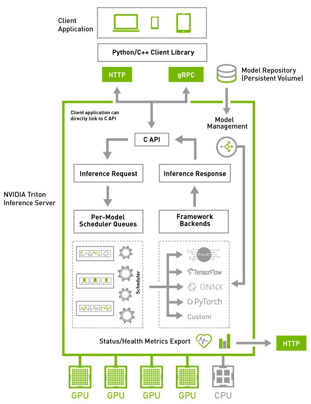

# Triton inferrence Server简介
一款开源推理服务软件，简化AI推理。  
***
同时支持在GPU、x86 和 ARM CPU 或 AWS Inferentia 上跨云、数据中心、边缘和嵌入式设备进行推理。  

能部署来自多个深度学习和机器学习框架的任何AI模型。(TensorRT、TensorFlow、PyTorch、ONNX、OpenVINO、Python、RAPIDS FIL)  
***
## Triton 结构
### 基本元素
1. 模型仓库（model repository）
   基于文件系统存储要使用的模型仓库。
3. 并发执行
4. 动态批处理
5. Pipeline建模（BLS）
6. 推理协议（HTTP/GRPC）
7. 请求响应调度及批处理
8. 后端C API
9. python/C++库



## Triton 模型推理快速实现
1. 创建模型仓库
```
git clone -b r22.06 https://github.com/triton-inference-server/server.git
cd server/docs/examples
./fetch_models.sh
```
2. 从NGC容器中启动triton server
```
# Step 2: Launch triton from the NGC Triton container
docker run --gpus=1 --rm --net=host -v /full/path/to/docs/examples/model_repository:/models nvcr.io/nvidia/tritonserver:22.06-py3 tritonserver --model-repository=/models
```
通过挂载外部文件选项-v进行绑定模型仓库和服务器
3. 在另一个console，从NGC Triton SDK容器中启动客户端
>docker run -it --rm --net=host nvcr.io/nvidia/tritonserver:22.06-py3-sdk
>/workspace/install/bin/image_client -m densenet_onnx -c 3 -s INCEPTION /workspace/images/mug.jpg
指定模型名称和输入通道和数据数据路径
4. 推理结果返回
